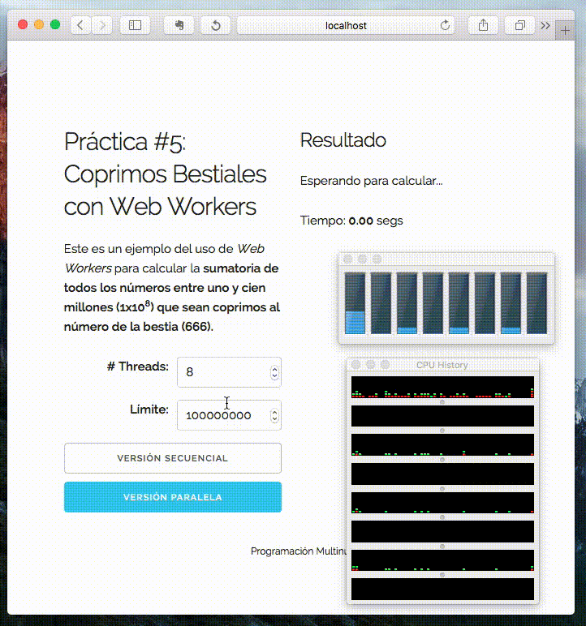

= Práctica #5: Coprimos Bestiales con Web Workers
:author: Fernando Gómez (A01020319)
:lang: es
:email: gomezhyuuga@gmail.com
:encoding: utf-8
:revdate: 31 de agosto, 2015
:numbered:

Este reporte fue elaborado para el curso de _Programación multinúcleo_ del
Tecnológico de Monterrey, Campus Estado de México.

:numbered:

== Introducción
La actividad realizada consistía en utilizar _Web Workers_ de Javascript para
calcular números coprimos y posteriormente sumarlos.
En específico se tenían que calcular *la sumatoria de todos los números entre uno
y 1x10^8^ que fueran coprimos al _número de la bestia_ (666)*

.Descripción general del algoritmo
Para calcular los números coprimos se utilizó el *Algoritmo de Euclides* <<Euclides>> que
nos permite encontrar el _GCD_ de un par de números. Para cada número +i+ del 1
hasta +1x10^8^+ se evalúa si el +GCD(i, 666) == 1+, entonces el número se suma al
resultado final.

[NOTE]
.Hardware y software utilizado
=============================
Los programas se probaron en una computadora de escritorio con las siguientes características:

- Procesador Intel(R) Core(TM) i7-3615QM CPU @ 2.30GHz con cuatro núcleos y ocho _hyperthreads_.
- RAM: 8 GB 1600 MHz DDR3
- Sistema operativo OS X El Capitan 10.11, Kernel Darwin Version 15.0.0
- Compilador Java 1.8.0_60-b27 de Oracle.
=============================

== Página Web
Para presentar la evaluación el algoritmo, se utilia la siguiente página web:

[source,html]
.index.html
----------------------------
include::index.html[]
----------------------------

== Solución secuencial
Para fines de ejemplo, a continuación se presenta la solución secuencial al
algoritmo, extraído del código final:

[source,javascript]
----------------------------
function gcd(a, b) {
  if (b === 0) return a;
  else return gcd(b, a % b);
}

var sum = 0;
for (var i = 1; i < 1e8; i++) {
  if (gcd(i, 666) === 1) sum += i;
}
console.log('Resultado: ' + sum);
----------------------------

La salida del código anterior es la siguiente:

[source,text]
----------------------------
Resultado: 1621621578378396
----------------------------

== Solución paralela
Implementando _Web Workers_ tenemos que separar el cálculo de los coprimos en
*diferentes rangos*: se particiona el cálculo en _N rangos_, donde N es igual
al número de threads deseados.
Ambos extremos de los rangos son convertidos al _entero menor más próximo_ y
el extremo superior del último rango se establece como 1x10^8^.

[source,javascript]
.main.js
----------------------------
include::js/main.js[]
----------------------------

[source,javascript]
.coprime_worker.js
----------------------------
include::js/coprime_worker.js[]
----------------------------

El resultado es el mismo que el de la solución secuencial. En la sección de
resultados se mostrará un _gif animado_ con la salida de cada solución.

== Resultados

A continuación se muestra un ejemplo de la corrida de las soluciones:

.Ejecución de código

.Tabla de tiempos de ejecución (expresados en segundos)
[options="header,footer", cols="^,^,^", width="70%"]
|=======================
|    # Corrida     | Tiempo secuencial (T~1~) | Tiempo paralelo (T~8~)
| 1 |	6.80 |	1.26
| 2 |	6.88 |	1.23
| 3 |	6.74 |	1.22
| 4 |	6.81 |	1.25
| 5 |	6.83 |	1.25
| Media aritmética |          6.81          |         1.24
|=======================

*****************************
S~8~ = T~1~ / T~8~ = 6.81 / 1.24 = 5.49
*****************************

Como podemos ver se obtuvo una gran mejora, alcanzando un _speedup_ de *5.49*.
Lo mejor todo es que, gracias a las ventajas de _Javascript y Web Workers_ podemos olvidarnos
de cosas como *condiciones de carrera* e implementar nuestros algoritmos de una
forma más sencilla.

== Referencias

[bibliography]
- [[[Euclides]]] Wikipedia. _Euclidean algorithm_.
  https://en.wikipedia.org/wiki/Euclidean_algorithm
